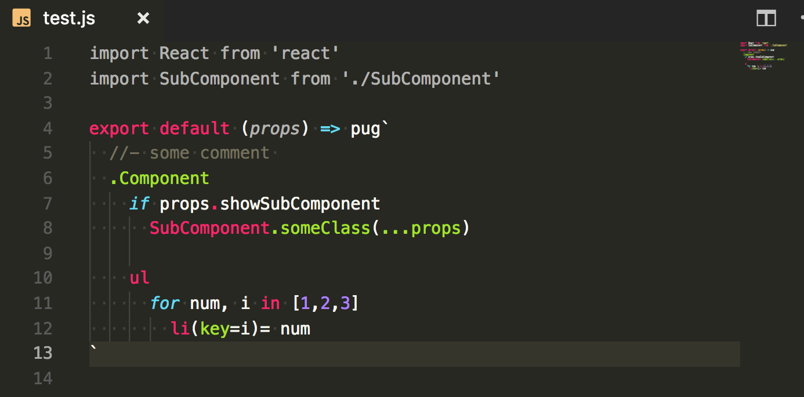

# vscode-react-pug

Syntax highlighting for pug with react [(babel-plugin-transform-react-pug)](https://github.com/pugjs/babel-plugin-transform-react-pug) in JavaScript and TypeScript.



## Install

Inside VSCode, press `Ctrl+P`, and enter:

```
ext install vscode-react-pug
```

[[Source](https://marketplace.visualstudio.com/items?itemName=kaminaly.vscode-react-pug)]